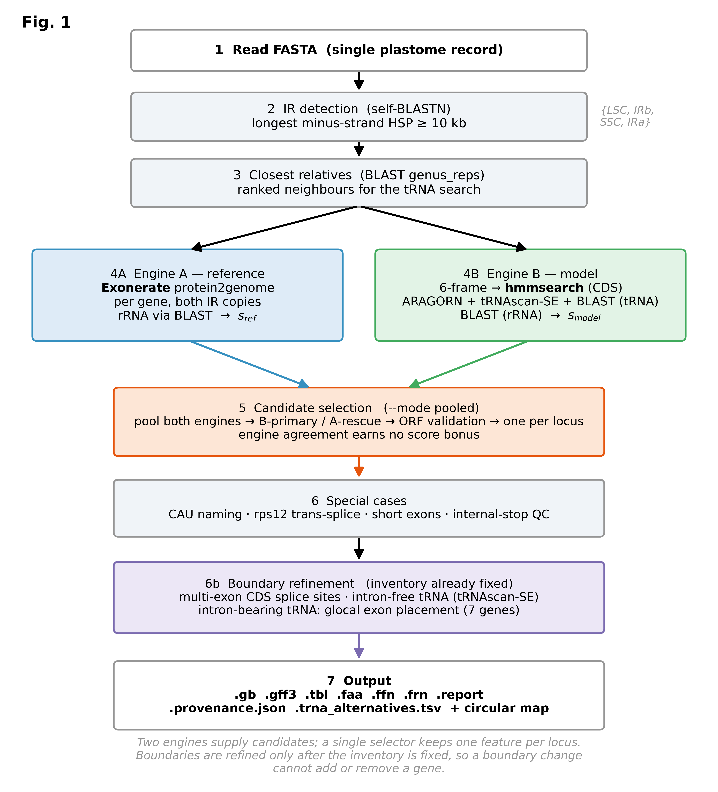

# Plastanno v2

**A hybrid, self-evaluating chloroplast-genome (plastome) annotator.**

[](https://github.com/maidinhvn/plastanno/actions/workflows/ci.yml)
[](https://doi.org/10.5281/zenodo.20807994)

Given a plastome FASTA, Plastanno predicts CDS, tRNA and rRNA features and writes
GenBank, GFF3, FASTA and report outputs — plus a circular plastome map. Its
defining design is **two independent engines that each propose candidates — one
reference-based, one model-based — pooled and resolved by a single selector that
keeps one feature per locus**, with a review flag and full provenance on every
feature. Boundaries are refined only after the inventory is settled, so a
boundary change can never add or remove a gene.

Earlier releases of this README quoted a held-out F1 and a head-to-head against
one other tool. Both have been withdrawn: the reference databases were built
before the evaluation split, so that "held-out" set was largely represented in
them, and the comparison used a scorer that has since been replaced. Measured
performance will be published with the manuscript, once the scorer and protocol
have had an independent review.

---

## How it works

A 7-step pipeline (`plastanno/pipeline.py`):

1. **Read FASTA** — single plastome record.
2. **IR detection** (`identify/ir_detector.py`) — self-BLASTN; the longest
   minus-strand HSP ≥ 10 kb defines the inverted-repeat pair → `{LSC, IRb, SSC, IRa}`.
3. **Closest relatives** (`identify/closest_rel.py`) — BLAST against genus
   representatives, ranked, for the tRNA search.
4. **Two engines, in parallel:**
   - **Engine A — reference-based** (`identify/engine_a.py`): Exonerate
     `protein2genome` per gene (IR genes searched in both copies); rRNA via BLAST.
   - **Engine B — model-based** (`identify/engine_b.py`): CDS via 6-frame
     translation → `hmmsearch`; tRNA via ARAGORN + tRNAscan-SE + BLAST; rRNA via BLAST.
5. **Candidate selection** (`core/reconcile.py`, `--mode pooled`) — both engines'
   candidates are pooled by gene name and one is kept per locus: Engine B's
   coordinates when its ORF check passes, Engine A as a rescue otherwise, both
   copies for an IR-duplicated gene. Agreement between the engines earns no score
   bonus — an ablation found it bought nothing measurable. `--mode legacy`
   restores the older cross-engine reconciliation.
6. **Special cases** (`annotate/special_cases.py`) — CAU tRNA disambiguation,
   *rps12* trans-splicing, short first exons, internal-stop QC.
6b. **Boundary refinement** — multi-exon CDS splice sites; intron-free tRNA ends
   from tRNAscan-SE (`--trna-mode`); the seven intron-bearing tRNA by glocal exon
   placement (`--intron-mode`). This runs after the inventory is fixed, by design.
7. **Output** (`output/writers.py`).

<p align="center">
  
</p>

`docs/figures/Fig2_selection.*` shows the selection layer in detail.

## Installation

**Supported platforms:** Linux and macOS. Windows is not supported directly (the
external tools and the helper shell scripts assume a Unix environment) — use
**WSL2** as a workaround.

Plastanno needs Python ≥ 3.9 with `biopython`, `pandas`, `numpy`, `scipy`,
`platformdirs` and `matplotlib` (the last only for the circular map), plus
**five** external tools on `PATH`: **BLAST+**, **Exonerate**, **HMMER**
(`hmmsearch`), **ARAGORN** and **tRNAscan-SE**.

> **tRNAscan-SE is required, not optional.** Since 3.0.0 the default
> `--trna-mode hybrid` takes intron-free tRNA ends from it, and the run stops
> before step 1 if it is not on `PATH`. `--trna-mode legacy` does not need it.

**Prerequisite:** a working `conda`. We recommend
[Miniforge](https://github.com/conda-forge/miniforge) (it defaults to the
conda-forge channel and avoids the Anaconda Terms-of-Service prompt noted below),
or [Miniconda](https://docs.conda.io/en/latest/miniconda.html).

### Recommended: install from Bioconda

The easiest way — conda pulls in `plastanno` together with every Python
dependency and external tool. No cloning, no `pip`:

```bash
conda config --set channel_priority strict   # recommended for bioconda
conda create -n plastanno -c conda-forge -c bioconda plastanno
conda activate plastanno

# REQUIRED before the first run: download the reference database (~266 MB)
plastanno fetch-db
```

The Bioconda package pulls in tRNAscan-SE along with everything else, so there
is nothing extra to install.

> List `conda-forge` before `bioconda` so it keeps the higher priority — this is
> the channel order Bioconda requires; with `channel_priority strict` it also
> speeds up the solver and avoids mixing incompatible builds.
>
> If `conda create` stops with a `CondaToSNonInteractiveError` (Anaconda Terms of
> Service not accepted), it is coming from the `defaults` channel — use Miniforge,
> which has no `defaults` channel, or append `--override-channels` to this one
> command to exclude it.

> **Solve is slow or hangs at "Examining conflict"?** This happens on an older
> Anaconda/Miniconda `base` that still uses the classic solver and mixes in the
> `defaults` channel. Switch to the fast libmamba solver and exclude `defaults`:
>
> ```bash
> conda install -n base conda-libmamba-solver   # if not already present
> conda config --set solver libmamba
> conda config --set channel_priority strict
> conda create -n plastanno -c conda-forge -c bioconda --override-channels plastanno
> ```
>
> Or just use [Miniforge](https://github.com/conda-forge/miniforge), which ships
> the libmamba solver and the `mamba` front-end (`mamba create …`) by default.

### Upgrading an existing installation

Plastanno is an ordinary conda package, so upgrading is handled by conda — there
is no self-update command:

```bash
conda activate plastanno
conda update -c conda-forge -c bioconda plastanno     # to the newest release
# or pin an exact release:
conda install -c conda-forge -c bioconda plastanno=2.0.4
```

Check what you are actually running (report this when asking for support, and
when citing the tool in a paper):

```bash
plastanno --version
```

The ~266 MB reference database lives outside the environment (in your user data
directory), so it **survives an upgrade** and does not need re-downloading. Only
re-fetch it if a release note says the database itself changed:

```bash
plastanno fetch-db --force
```

> Installing on a shared/HPC Anaconda you do not own? If conda cannot write to
> its package cache (`Could not open lockfile … pkgs/cache/cache.lock`, or a solve
> that hangs indefinitely), point the cache at your own account — no `sudo`
> needed:
>
> ```bash
> export CONDA_PKGS_DIRS=$HOME/.conda/pkgs
> ```

### From source (developers / unreleased code)

Use this only to run a development checkout. Here `pip install .` is run **from
inside the cloned repository**, so the leading `git clone && cd` matters:

```bash
git clone https://github.com/maidinhvn/plastanno.git
cd plastanno

# create the environment (Python deps + all external tools) from the pinned file
conda env create -f environment.yml
conda activate plastanno

# install the `plastanno` command from this checkout
pip install .

# REQUIRED before the first run: download the reference database (~266 MB)
plastanno fetch-db
```

`environment.yml` pins the channels and lists every dependency. To build the
environment by hand instead, the equivalent one-liner is:

```bash
conda create -n plastanno -c conda-forge -c bioconda \
    python=3.10 biopython pandas matplotlib platformdirs blast exonerate hmmer aragorn
```

(Same channel-order / Terms-of-Service notes as above apply.) You can also skip
`pip install .` and run the tool directly from the checkout with
`python3 plastanno.py …` (see [Usage](#usage)).

`plastanno fetch-db` downloads the database into a platform data directory
(`~/.local/share/plastanno/database` on Linux). Override the location with
`$PLASTANNO_DB`. Running from a source checkout without installing also works:
use `python3 plastanno.py …` and `bash scripts/get_database.sh` (which places the
database under `./database`).

Then verify everything is found (modules, databases, external tools):

```bash
bash diagnose.sh
```

The Exonerate executable is resolved from `$PLASTANNO_EXONERATE`, then `PATH`,
then a built-in default — set `PLASTANNO_EXONERATE` if yours is elsewhere.

## Usage

> **Before running:** the reference database must be present — run
> `plastanno fetch-db` once (see [Databases](#databases)). Without it, annotation
> stops at the "Finding closest relatives" step with a BLAST database error.

```bash
# Annotate ONE genome (a single FASTA file) -> 6 files + a circular map
# (.png/.pdf/.svg) in out/
plastanno run genome.fasta --output out/ --threads 8

# Skip the map (e.g. for large batches / benchmarks)
plastanno run genome.fasta --output out/ --no-plot

# Annotate a WHOLE FOLDER: pass the DIRECTORY path (not a file, not a glob).
# `batch` scans that directory itself for every *.fasta and *.fa inside it.
plastanno batch genomes/ --output out/ --threads 8
```

> **Note on `batch`:** the argument is a *directory*, e.g. `genomes/`. Do **not**
> pass a shell glob — `plastanno batch genomes/*.fasta` does not work, because the
> shell expands it to many paths while `batch` expects a single folder. Put the
> FASTA files in one directory and point `batch` at that directory; it picks up
> the `*.fasta` / `*.fa` files for you.

> Running from a source checkout without `pip install`? Use `python3 plastanno.py
> run …` (and `bash scripts/get_database.sh`) — the same commands work unchanged.

### Optional inputs

Both are off by default, so default output is unchanged:

```bash
# Overlay a closely-related annotated reference (GenBank): its per-gene proteins
# are tried first in Engine A, with automatic fallback to the built-in DB.
python3 plastanno.py run genome.fasta -o out/ --reference close_relative.gb

# Add tRNAscan-SE as an extra tRNA DETECTION source; contributes intronless
# tRNAs alongside ARAGORN/BLAST. This is separate from --trna-mode hybrid (the
# default), where tRNAscan-SE sets the BOUNDARIES of tRNA that were already
# found; that one changes no locus, this one can add loci.
python3 plastanno.py run genome.fasta -o out/ --trnascan
```

### Naming the organism (needed for GenBank submission)

Without `--organism`, the GenBank output carries the generic placeholder
`Viridiplantae` in `/organism`, `SOURCE`/`ORGANISM` and the `DEFINITION` line
(the run prints a reminder). That is fine for internal analysis, but it would
assign the wrong taxon in an NCBI submission, and downstream tools that read
`/organism` — for example CPJSdraw — will label every sample identically.

```bash
plastanno run CA1.fasta -o out/ --prefix CA1 --organism "Centella asiatica"
```

The name is written consistently to `DEFINITION`, `SOURCE`, `ORGANISM`,
the source feature's `/organism`, and the circular-map title. The source feature
also carries `/mol_type="genomic DNA"` and `/organelle="plastid:chloroplast"`.

Use `--prefix` to give each sample a short, unique id: it becomes the GenBank
`LOCUS` name (which the format limits to 16 characters) and the output filenames.

### Worked example

Two land-plant plastomes are bundled under [`example/`](example/) so you can try
the tool immediately (you still need the external tools and the full `database/`):

- `example/NC_053537.1.fasta` — *Gynostemma yixingense* (Cucurbitales)
- `example/NC_008325.1.fasta` — *Daucus carota* (carrot, Apiaceae)

```bash
# Annotate one of the examples (writes 6 files + a circular map)
python3 plastanno.py run example/NC_053537.1.fasta --output out_example/NC_053537.1 --threads 4

# ...or run the bundled script, which does a single run and a batch run
bash example/run_example.sh
```

`example/NC_053537.1.fasta` should yield ~129 genes; open
`out_example/NC_053537.1/NC_053537.1.report` for the categorised gene-group
summary, and `..._map.png` for the circular map.

### Outputs

| File | Contents |
|------|----------|
| `<acc>.gb` | GenBank with provenance in each `/note` |
| `<acc>.gff3` | GFF3 with confidence flags; one CDS line per exon, with phase |
| `<acc>.tbl` | NCBI 5-column feature table — the file `table2asn` needs to build a submission (`.sqn`); supply your own `.sbt` template |
| `<acc>.faa` / `.ffn` / `.frn` | protein / CDS-nucleotide / RNA FASTA |
| `<acc>.report` | QC summary: IR boundaries, confidence distribution, a categorised functional gene table, and features flagged for review |
| `<acc>_map.png/.pdf/.svg` | circular plastome map (unless `--no-plot`) |

## Databases

`database/` holds the reference data the engines use: genus-representative BLAST
databases, per-gene reference proteins, profile HMMs, a taxonomically tiered tRNA
database, an intron-exon database, full-length rRNA databases, a per-gene exon
panel and length templates, and `gene_catalog.json`.

**The large reference databases (~266 MB compressed download, ~700 MB once
extracted) are not in this Git repository** —
GitHub's per-file size limit makes them unsuitable for version control. Only the
small runtime configs (`gene_catalog.json`, `boundary_db/`, `exon_templates.json`)
are tracked. To run the tool after cloning, obtain the full `database/` in one of
three ways:

1. **Automatic (recommended):** run
   ```bash
   bash scripts/get_database.sh
   ```
   which downloads the archive from Zenodo, verifies its checksum, and unpacks it
   into `database/`.
2. **Manual:** download `plastanno-database.tar.gz` from Zenodo
   ([doi.org/10.5281/zenodo.20807994](https://doi.org/10.5281/zenodo.20807994))
   and `tar xzf plastanno-database.tar.gz` so its contents sit in `database/`.
3. **Rebuild:** `python3 scripts/build/build_all.py` (see that script's header
   for inputs).

For a ready-to-run copy that already bundles the databases, use the release
tarball instead of cloning.

## Benchmarking

Quality is measured by gene-by-gene comparison against reference GenBank files
(true positive = name match + both ends within ±tol bp + sequence similarity):

```bash
# Score one predicted .gb against a reference .gb
python3 scripts/benchmark/benchmark_gene_by_gene.py reference.gb predicted.gb --tol 60 --sim 0.6

# Aggregate F1 over a sample
python3 scripts/benchmark/multi_genome_bench.py --n 120 --workers 16
```

## Performance

**No overall accuracy figure is quoted here**, and no comparison against another
tool — those are the two claims withdrawn in the introduction. The design targets
carried over from the predecessor tool are CDS Sn > 92% / Pr > 95%, rRNA
Sn/Pr > 97%, tRNA Sn > 88% / Pr > 90%.

`plastanno run --help` does quote numbers, and they stand. They are a different
kind of measurement: each compares two modes of *this* tool on the same genomes
(for example `--intron-mode`, exact tRNA coordinates 13.0% → 55.1% over 5,178
loci in 645 plastomes, 0 loci made worse), so the comparison is internal and
paired. None of them comes from the contaminated held-out set, and none ranks
Plastanno against another tool. What needs the independent review is the overall
figure and the cross-tool comparison, not these.

**Runtime is a deliberate trade.** The original target was < 60 s per genome and
the 3.0.0 defaults do not meet it: `--trna-mode hybrid` and `--intron-mode
glocal` buy tRNA boundary accuracy at the cost of several times the runtime.
Setting both to `legacy` returns roughly the old speed and the old boundaries.
Exonerate does not scale with threads, so batch work is best parallelised across
genomes rather than within one.

## Citation

If you use Plastanno, please cite the manuscript (in preparation; see `docs/`) and
the reference-database archive on Zenodo:
[doi.org/10.5281/zenodo.20807994](https://doi.org/10.5281/zenodo.20807994).

## License

See [LICENSE](LICENSE).
